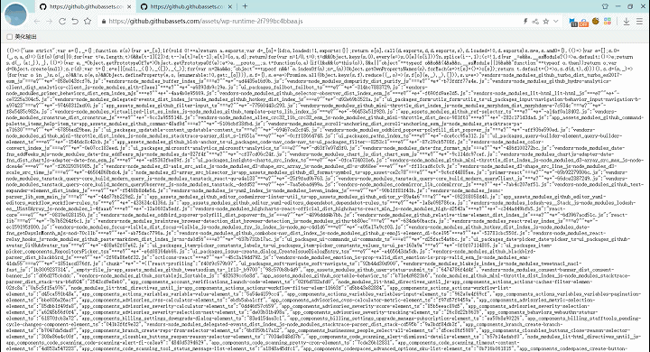

适用于  [Tampermonkey](https://www.tampermonkey.net/) ， [Violentmonkey](https://violentmonkey.github.io/)， [Greasemonkey](https://www.greasespot.net/)，[ScriptCat](https://docs.scriptcat.org/)的JSON格式化脚本

脚本地址：<https://greasyfork.org/zh-CN/scripts/508417-json-viewer>

GitHub地址：<https://github.com/xFeny/monkey-jsonviewer>

### 实现的功能

- 两种格式化JSON风格，默认树形/表格树形
- 节点全部折叠/展开
- 复制JSON数据到剪切板
- JSON数据和JSON脑图可以保存为文件
- 支持使用JSON Crack查看
- 支持手动输入JSON
- 支持通过HTTP请求方式获取JSON
- 过滤JSON，模糊查找key和value的值
- JSON格式化和JOSN脑图，鼠标移入JSON的key上面提示JSONPath，并可复制JSONPath
- 原始数据美化输出
- 支持JS、CSS美化数据

### 效果图

##### JSON格式化和主题色

 

##### JSON脑图和JSON Crack

 

##### JSON手动输入

 

##### HTTP 请求

 

##### JS 美化

 
  
##### CSS 美化

 

