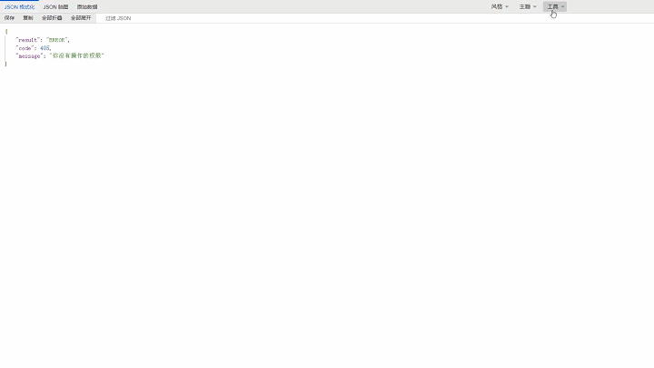

适用于  [Tampermonkey](https://www.tampermonkey.net/) ， [Violentmonkey](https://violentmonkey.github.io/)， [Greasemonkey](https://www.greasespot.net/)，[ScriptCat](https://docs.scriptcat.org/)的 `JSON` 格式化脚本

脚本地址：<https://greasyfork.org/zh-CN/scripts/508417-json-viewer>

GitHub地址：<https://github.com/xFeny/monkey-jsonviewer>

### 实现的功能

- 支持两种风格 `JSON` 格式化。
- 支持 `JSON` 格式化主题色切换，浅色/暗黑。
- 支持节点全部折叠/展开。
- 支持复制 `JSON` 数据到剪切板。
- 支持将 `JSON` 数据保存为`.json`文件和 `JSON` 脑图保存为图片。
- 支持通过 `JSON Crack` 可视化工具查看 `JSON。`
- 支持手动输入 `JSON`，支持通过`HTTP` 请求方式获取 `JSON` 。
- 支持过滤 `JSON`，模糊查找`key`和`value。`
- 支持鼠标移入提示 `JSONPath`。
- 支持原始数据美化输出。
- 支持显示 `JSON` `value` 颜色。
- 支持将超过`15`位的数字转换为 `BigInt`，而不是超出部分显示 `0`。
- 支持将 `JS`、`CSS` 美化输出。

### 效果图

##### 超过 `15` 位的数字和显示颜色

 

##### `JSON` 格式化和主题色

 

##### `JSON` 脑图和 `JSON Crack`

 

##### `JSON` 手动输入

 

##### `HTTP` 请求

 

##### `JS`、`CSS` 美化

 
