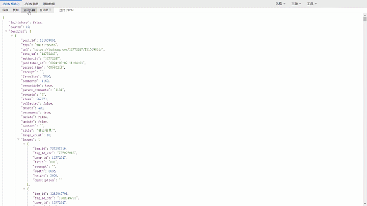

适用于  [Tampermonkey](https://www.tampermonkey.net/) ， [Violentmonkey](https://violentmonkey.github.io/)， [Greasemonkey](https://www.greasespot.net/)，[ScriptCat](https://docs.scriptcat.org/)的JSON格式化脚本

脚本地址：<https://greasyfork.org/zh-CN/scripts/508417-json-viewer>

GitHub地址：<https://github.com/xFeny/monkey-jsonviewer

### 实现的功能

- 支持默认树形/表格，格式化JSON
- 支持节点全部折叠/展开
- 支持复制JSON数据到剪切板
- 支持将JSON数据保存为`.json`文件和JSON脑图保存为图片
- 支持使用JSON Crack查看
- 支持手动输入JSON
- 支持通过HTTP请求方式获取JSON
- 支持模糊查找key和value的值来过滤JSON
- 支持鼠标移入提示JSONPath
- 支持原始数据美化输出
- 支持JS、CSS美化输出

### 效果图

##### JSON格式化和主题色

 

##### JSON脑图和JSON Crack

 

##### JSON手动输入

 

##### HTTP 请求

 

##### JS 美化

 

##### CSS 美化

 

